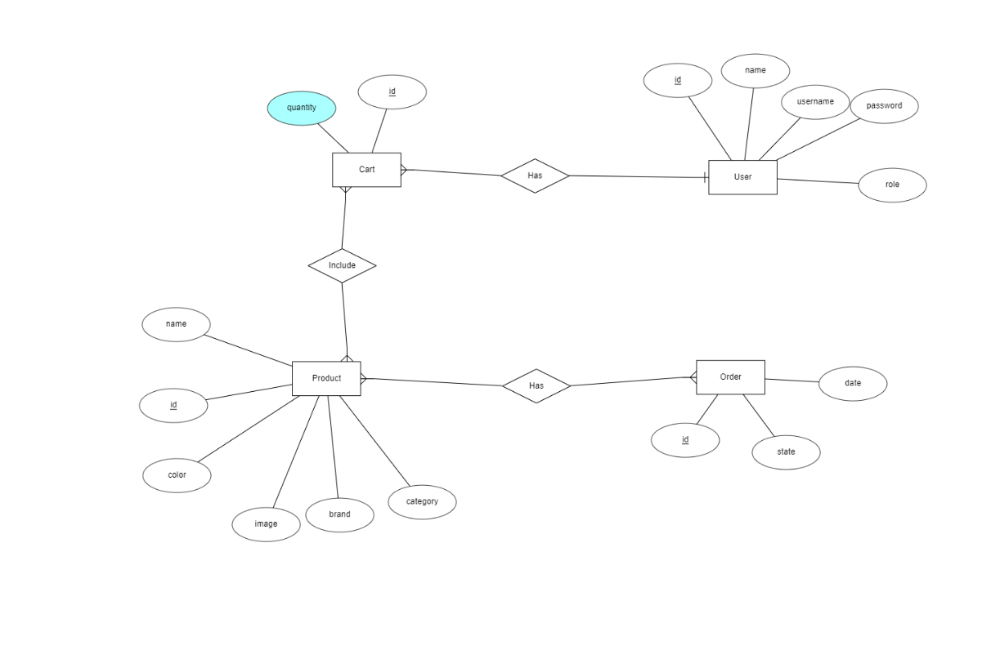
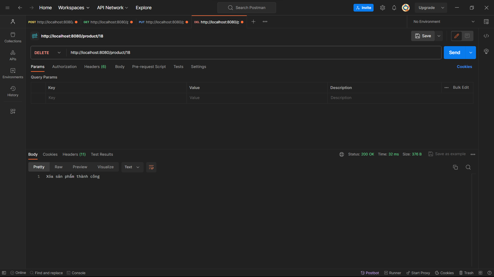
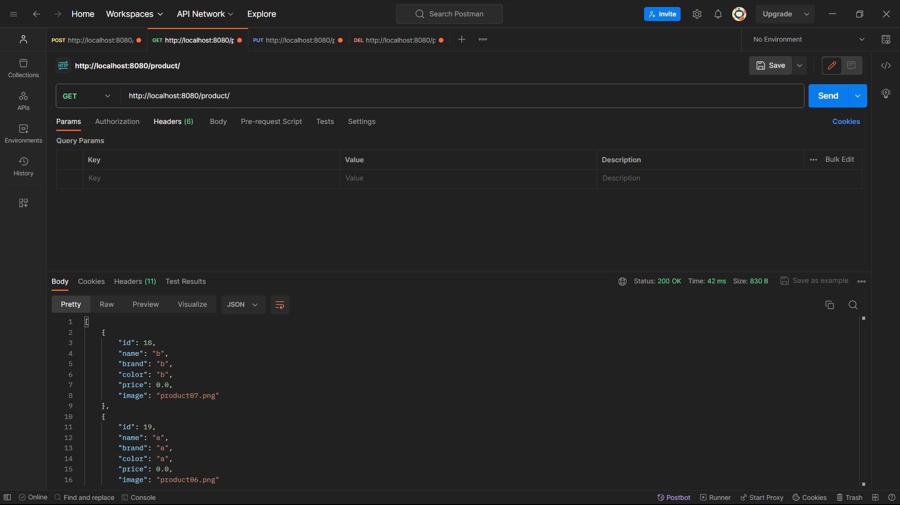
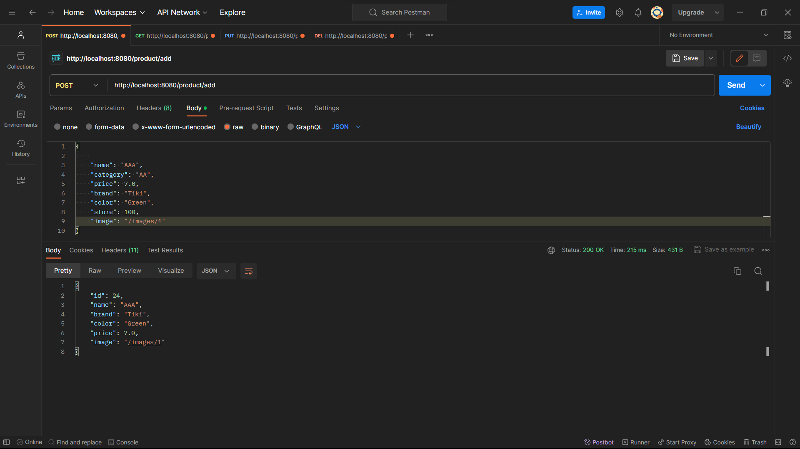
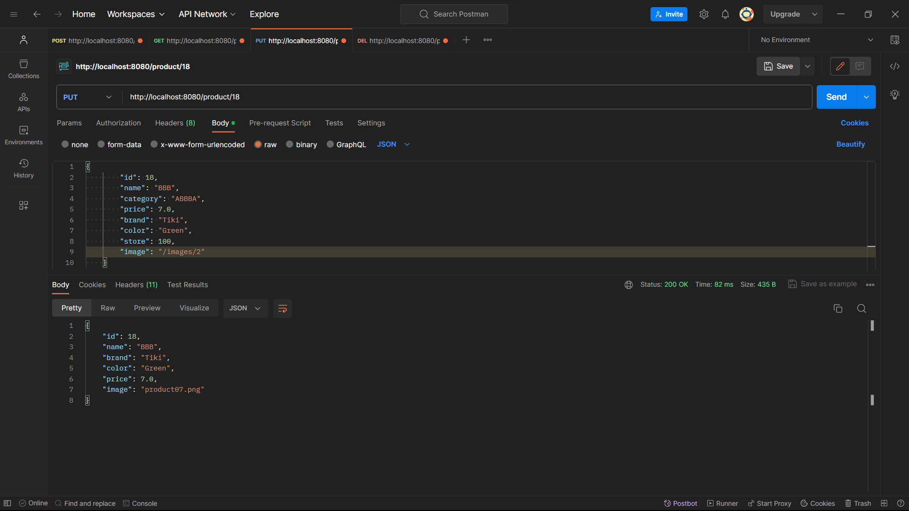

I.Software development principles, patterns and practices

1. Principles
    Nguyên tắc phát triển phần mềm được áp dụng là phương pháp SOLID để đảm bảo tính linh hoạt và bảo trì của ứng dụng

    “SOLID” là tập hợp 5 nguyên lý sau:
    Single responsibility principle (nguyên lý Trách nhiệm Duy nhất)
    Open/closed principle (nguyên lý Đóng/mở)
    Liskov substitution principle (nguyên lý Thay thế Liskov)
    Interface segregation principle (nguyên lý Phân tách Interface)
    Dependency inversion principle (nguyên lý Đảo ngược Phụ thuộc)
    
    S – Single responsibility principle: Một lớp chỉ nên đảm nhiệm một trách nhiệm duy nhất (Nghĩa là chỉ có thể sửa đổi lớp đó với 1 lý do duy nhất).

    O – Open/closed principle: Có thể thoái mái mở rộng một lớp, nhưng không được sửa đổi bên trong lớp đó.

    L – Liskov substitution principle: Trong một chương trình, các đối tượng của lớp con có thể thay thế đối tượng của lớp cha mà không làm thay đổi tính đúng đắn của chương trình

    I – Interface segregation principle: Thay vì dùng một interface lớn, ta nên tách thành nhiều interface nhỏ, với nhiều mục đích cụ thể.

    D – Dependency inversion principle: Các module cấp cao không nên phụ thuộc vào các modules cấp thấp. Cả hai nên phụ thuộc vào abstraction. Abstraction không nên phụ thuộc vào chi tiết, mà ngược lại (Các lớp giao tiếp với nhau thông qua interface, không phải thông qua triển khai.)

2. Patterns
    Sử dụng Model-View-Controller (MVC) để phân tách các lớp và giảm sự phụ thuộc giữa chúng.

    Model chịu trách nhiệm về dữ liệu và logic xử lý dữ liệu, 

    View hiển thị dữ liệu cho người dùng

    Controller điều khiển quá trình thực thi.

3. Practices
    Sử dụng phương pháp Agile để phát triển ứng dụng. Điều này cho phép tối ưu hóa quy trình phát triển, đáp ứng nhanh chóng các yêu cầu thay đổi và làm việc hiệu quả với nhóm phát triển.

II. Entity-relationship diagram
    

III. steps in order to get the application run on a local computer
    B1: setup spring.datasource.url trong application.properties
    B2: Tạo database trên hệ quản trị mysql ứng với tên database vừa setup ở B1
    B3: chạy chương trình

IV. POSTMAN

    ProductAPI:
        1. [DELETE] /products/{id} --- xóa sản phẩm dựa trên id truyền vào

        2. [GET] /product/ --- lấy tất cả sản phẩm

        3. [POST] /product/add --- thêm sản phẩm mới

        4. [UPDATE] /product/{id} --- cập nhật sản phẩm

